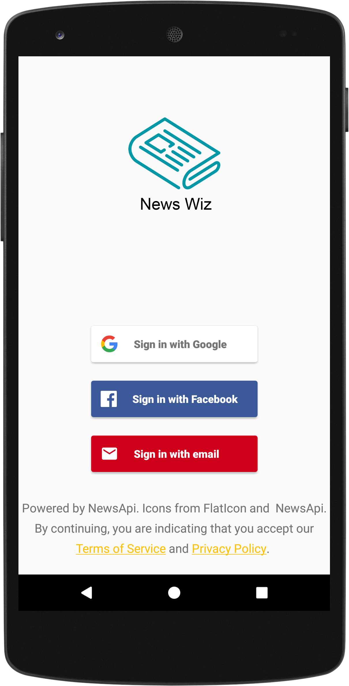
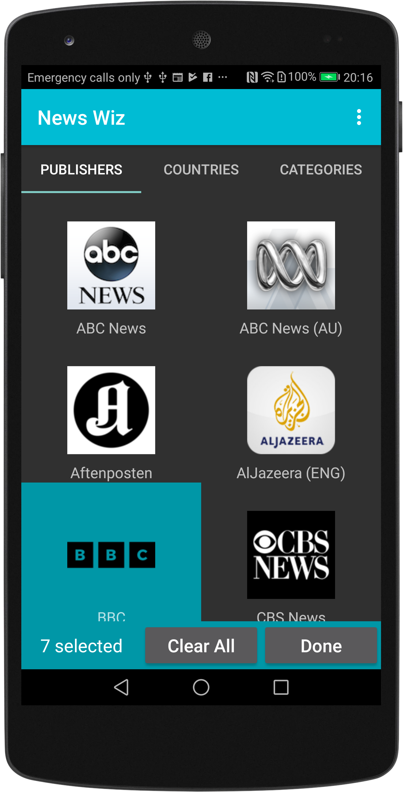
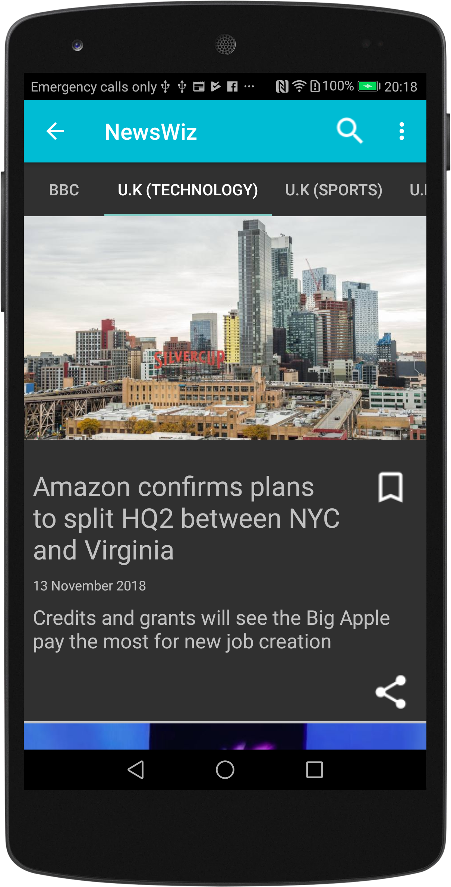
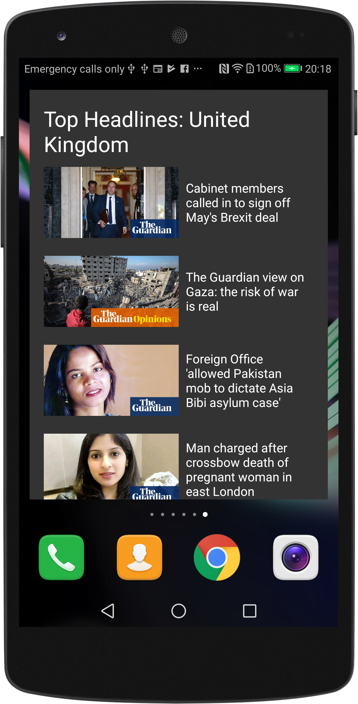
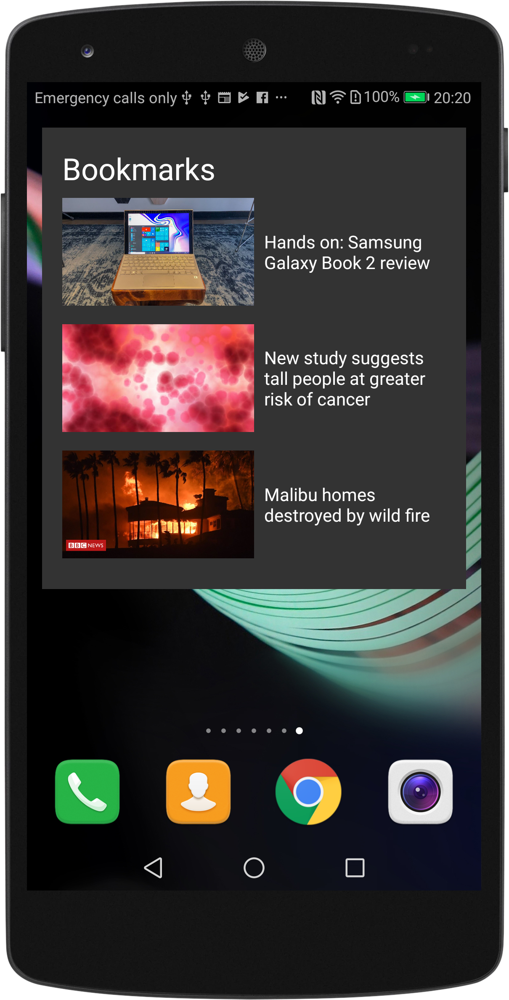

# Capstone Project
A News app for the final project in Udacity's Android Developer Nanodegree.

This app uses the newsapi sources to retrieve data on the latest news specific to the user's interests. You can get a free developer API key from [NewsAPI.org](https://newsapi.org) which you will need to put in the gradle.properties file.

To run this app you need to set up [Firebase](https://firebase.google.com/docs/android/setup "Add Firebase to Your Android Project") which will generate an APP ID for you in the console and will make a google-services.json file.

When you have setup Firebase you need to add the google-services.json file to the app folder. The app also implements [Firebase database](https://firebase.google.com/docs/database/android/start/) which you can setup when you log into your Firebase console.

You will also need to go to the Strings.xml file to put in the Facebook App ID for the Firebase federated login for Facebook. More details on how to setup [Firebase UI for Auth](https://github.com/firebase/FirebaseUI-Android/blob/master/auth/README.md)

## Screenshots

The user can login using Gmail, Facebook or other e-mail. This intention is that the user's account is created in Firebase database when user logs in the first time. As the user logs in, they can choose a variety of different news sources. Once chosen, the user's settings are saved onto the Firebase database so that if they log into the app onto another device, the settings are persisted.

 

&nbsp;&nbsp;&nbsp;&nbsp;&nbsp;&nbsp;&nbsp;&nbsp;&nbsp;&nbsp;&nbsp;&nbsp;&nbsp;&nbsp;
  

The user can search for articles and bookmark articles. The app comes with a widget for displaying the top headlines for the country of their choice and a widget for displaying their bookmarked articles.

 

&nbsp;&nbsp;&nbsp;&nbsp;&nbsp;&nbsp;&nbsp;&nbsp;&nbsp;&nbsp;&nbsp;&nbsp;&nbsp;&nbsp;

